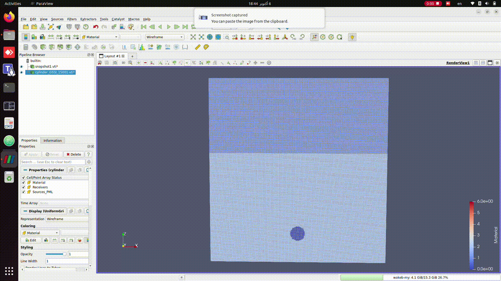

# Wakeb_GPR_Autonomous

## Description

Modeling and simulation of ground penetration radar (GPR) sensor in python3.
The simulation is based on [gprMax](https://github.com/gprMax/gprMax) simulator.

### License

Apache License, Version 2.0

**Maintainer: Mohamed Magdy<br />**

## Table of contents

* [Installation](#Installation)
* [Usage](#Usage)


## Installation

**1- conda**:

```
conda update conda
conda install git
git clone https://github.com/gprMax/gprMax.git
cd gprMax
# inside the gprMax directory.
conda env create -f conda_env.yml
```

**2- pip**:

inside the gprMax directory.
```
pip3 install -r requirements.txt
python3 setup.py build
python3 setup.py install
```

## Usage

```
# Process the input file, rquires pycuda, cuda toolkit installed. 60 iterations
python3 -m gprMax model1.in -n 60 -gpu

# Produce single output file model1.out from the model1[60].out files
python3 -m tools.outputfiles_merge model1 --remove-files

# Plot Bscan of Electric field in y direction [Ex, Ez, Hx, Hy, Hz edit here]
python3 -m tools.plot_Bscan model1.out  Ey
```
**Electric Field Strength in y-axis (Rx)**


**Magnetic Field Strength in y-axis (Rx)**


**Simple model Animation in Python**
inside scripts directory run animate.py script.
```
python3 animate.py
```


**3D Animation of Fields and Matrials and motion using Paraview program**

Geometry files use the open source Visualization ToolKit (VTK) format which can be viewed in many free readers, such as Paraview. Paraview is an open-source, multi-platform data analysis and visualization application. It is available for Linux, Mac OS X, and Windows.

The #geometry_view: command produces either ImageData (.vti) for a per-cell geometry view, or PolygonalData (.vtp) for a per-cell-edge geometry view. The per-cell geometry views also show the location of the PML regions and any sources and receivers in the model. The following are steps to get started with viewing geometry files in Paraview:


* 1- Install Paraview
* 2- Open the snapshot.vti or the geometry_view.vti
* 3- Click the Apply button in the Properties panel. You should see an outline of the volume of the geometry view.
* 4- Change field magnitude, coloring, materials in the left panel.

**GPR motion animation with domain settings [Sand, air materials], metallic cylinder buried in the sand**


**Electric Field Propgation**



---------------------------------------------------------------------------------

**Complex/Fractical Material with Rough Surface**

```
# Process the input file, rquires pycuda, cuda toolkit installed. 60 iterations
# model3.in models rough terrain with complex materials
python3 -m gprMax model3.in -n 60 -gpu

# Produce single output file model1.out from the model1[60].out files
python3 -m tools.outputfiles_merge model3 --remove-files

# Plot Bscan of Electric field in y direction [Ex, Ez, Hx, Hy, Hz edit here]
python3 -m tools.plot_Bscan model3.out  Ey
```

**Electric Field Propgation**


**Mag Field Propgation**


**Electric Field Strength in y-axis (Rx)**


**Magnetic Field Strength in y-axis (Rx)**


